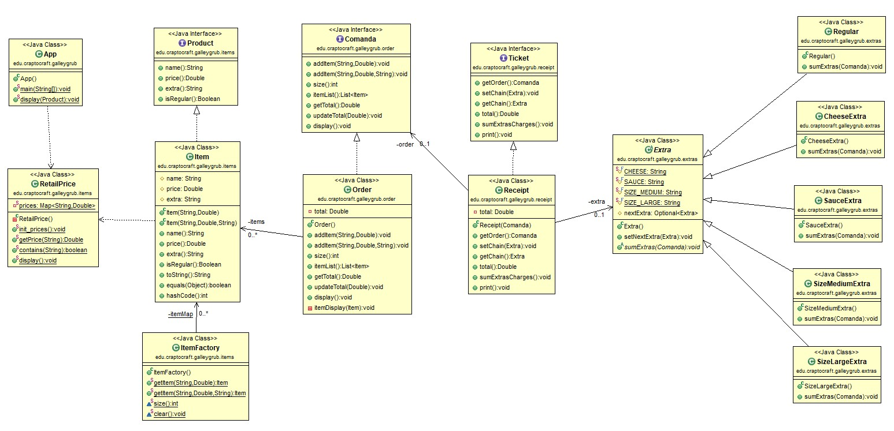

# Galley Grub

**Table of contents**

-   [**Introduction**](#introduction)
-   [**About the exam**](#about-the-exam)
-   [**UML Diagram**](#uml-diagram)
-   [**Application output**](#application-output)

## Introduction

This is an exam in Java of previous years of Proggramation in CIFP Francesc de Borja Moll. The idea was to practice Java and gain a deeper understanding of Hash Maps, Lists, Conditional (Ternary) Operators, and the [Chain-of-responsibility](https://en.wikipedia.org/wiki/Chain-of-responsibility_pattern) and [Flyweight](https://en.wikipedia.org/wiki/Flyweight_pattern) patterns.   

**Link of the exam:** [Galley Grub](https://github.com/dfleta/galley-grub).  

## About the exam

SpongeBob works as a chef at the famous Krusty Krab restaurant, known for their signature Krabby Patty burger. The restaurant has a menu called Galley Grub, which is available to view online. Orders are taken by hand by Squidward Tentacles, but instead of purchasing a POS system, the owner, Mr. Krabs, has decided to hire a Dual student to program software to calculate the total order amount and print receipts. Pretend to program or risk ending up helping Bob prepare Krusty Burgers in the kitchen.   

## UML Diagram

## Application output

   
   
